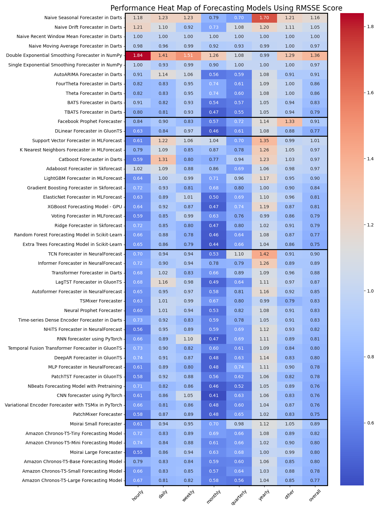

# Ready Tensor Forecasting Benchmark

## Overview

The "Ready Tensor Forecasting Benchmark" project is an ongoing effort dedicated to comparing a growing collection of forecasting models, currently including 80 models categorized into naive (baseline), statistical, machine learning, neural networks, and statistical/machine learning hybrids.

This project focuses on univariate forecasting, where the primary task is to predict a single response variable, though we also accommodate the use of exogenous features (covariates) to enhance forecasting accuracy.

Utilizing 24 diverse datasets with varying time frequencies—from hourly to yearly—and incorporating synthetic datasets without specific frequencies, we explore a broad spectrum of forecasting scenarios. These datasets are distinct not only in their temporal dimensions but also in the presence and type of covariates, ranging from static and historical to future-oriented variables, adding depth and complexity to the benchmarking process.

Our evaluation employs metrics like RMSE, MAE, RMSSE, and MASE, where RMSSE and MASE are particularly insightful as they benchmark a model's performance relative to a simple naive forecast.

As an evolving project, we continuously incorporate new models into our benchmarking, ensuring that our findings remain up-to-date with the latest developments in forecasting. This process helps users identify the most effective models for their specific forecasting tasks, emphasizing the importance of both the univariate focus and the strategic inclusion of covariates.

## Models and Categories

In this project, forecasting models are systematically organized into five distinct categories based on their underlying methodologies and typical use cases. This categorization facilitates a clearer comparison of model performances across different types of time series data. Below is an overview of each category along with examples to illustrate the diversity of models considered:

### 1. Naive

Naive models establish the baseline for forecasting performance, utilizing straightforward prediction strategies based on historical data trends.

- **Examples:** Naive Mean, Naive Drift, Naive Seasonal.

### 2. Statistical

These models employ traditional statistical methods to analyze and forecast time series data, capturing explicit components such as trend and seasonality.

- **Examples:** ARIMA (AutoARIMA), Exponential Smoothing, Seasonal Decomposition of Time Series (STL), Theta Method.

### 3. Hybrid (Statistical + Machine Learning)

This category includes models that combine elements of both statistical and machine learning approaches to leverage the strengths of each in forecasting applications. These hybrids aim to improve forecast accuracy and reliability by integrating statistical models' interpretability with machine learning models' adaptability.

- **Examples:** Prophet (combines decomposable time series models with machine learning techniques), D-Linear Forecaster in GluonTS (merges linear statistical forecasting with machine learning enhancements).

### 4. Machine Learning

Machine Learning models apply various algorithmic approaches learned from data to predict future values, including both regression and classification techniques tailored for forecasting.

- **Examples:** Random Forest, Gradient Boosting Machines (GBM), Support Vector Machines (SVM), Elastic Net Regression.

### 5. Neural-Network

Utilizing deep learning architectures, Neural-Network models are adept at modeling complex and non-linear relationships within large datasets.

- **Examples:** NBeats, RNN (LSTM), Convolutional Neural Networks (CNN), PatchTST, TSMixer, Transformer models.

## List of Models and their URLS

The following table lists the 43 forecasting models included in the published benchmark results, along with their respective categories, model names, and repository URLs. These models are implemented in various libraries and frameworks, including Darts, NumPy, GluonTS, MLForecast, Skforecast, Scikit-Learn, NeuralForecast, and PyTorch. The repository URLs provide access to the source code and documentation for each model, enabling users to explore and implement these models in their own forecasting tasks.

| category                       | model_name                                             | repo_url                                                                         |
| ------------------------------ | ------------------------------------------------------ | -------------------------------------------------------------------------------- |
| naïve (baseline)               | Naive Seasonal Forecaster in Darts                     | https://github.com/readytensor/rt_forecasting_darts_naive_seasonal               |
| naïve (baseline)               | Naive Drift Forecaster in Darts                        | https://github.com/readytensor/rt_forecasting_darts_naive_drift                  |
| naïve (baseline)               | Naive Recent Window Mean Forecaster in Darts           | https://github.com/readytensor/rt_forecasting_darts_naive_recent_window_mean     |
| naïve (baseline)               | Naive Moving Average Forecaster in Darts               | https://github.com/readytensor/rt_forecasting_darts_naive_moving_average         |
| statistical                    | Double Exponential Smoothing Forecaster in NumPy       | https://github.com/readytensor/rt_forecasting_single_exponential_smoothing_numpy |
| statistical                    | Single Exponential Smoothing Forecaster in NumPy       | https://github.com/readytensor/rt_forecasting_double_exponential_smoothing_numpy |
| statistical                    | AutoARIMA Forecaster in Darts                          | https://github.com/readytensor/rt_forecasting_darts_AutoARIMA                    |
| statistical                    | BATS Forecaster in Darts                               | https://github.com/readytensor/rt_forecasting_darts_BATS                         |
| statistical                    | FourTheta Forecaster in Darts                          | https://github.com/readytensor/rt_forecasting_darts_FourTheta                    |
| statistical                    | Theta Forecaster in Darts                              | https://github.com/readytensor/rt_forecasting_darts_Theta                        |
| statistical                    | TBATS Forecaster in Darts                              | https://github.com/readytensor/rt_forecasting_darts_TBATS                        |
| statistical / machine-learning | Facebook Prophet Forecaster                            | https://github.com/readytensor/rt_forecasting_prophet                            |
| statistical / machine-learning | DLinear Forecaster in GluonTS                          | https://github.com/readytensor/rt_forecasting_gluonts_D-Linear                   |
| machine-learning               | Support Vector Forecaster in MLForecast                | https://github.com/readytensor/rt_forecasting_mlforecast_svr                     |
| machine-learning               | K Nearest Neighbors Forecaster in MLForecast           | https://github.com/readytensor/rt_forecasting_mlforecast_knn                     |
| machine-learning               | Adaboost Forecaster in Skforecast                      | https://github.com/readytensor/rt_forecasting_skforecast_Adaboost                |
| machine-learning               | Catboost Forecaster in Darts                           | https://github.com/readytensor/rt_forecasting_darts_Catboost                     |
| machine-learning               | LightGBM Forecaster in MLForecast                      | https://github.com/readytensor/rt_forecasting_mlforecast_lightgbm                |
| machine-learning               | Gradient Boosting Forecaster in Skforecast             | https://github.com/readytensor/rt_forecasting_skforecast_GradientBoosting        |
| machine-learning               | ElasticNet Forecaster in MLForecast                    | https://github.com/readytensor/rt_forecasting_mlforecast_elasticnet              |
| machine-learning               | XGBoost Forecasting Model in Scikit-Learn              | https://github.com/readytensor/rt_forecasting_skforecast_xgboost                 |
| machine-learning               | Voting Forecaster in MLForecast                        | https://github.com/readytensor/rt_forecasting_mlforecast_voting                  |
| machine-learning               | Ridge Forecaster in Skforecast                         | https://github.com/readytensor/rt_forecasting_skforecast_Ridge                   |
| machine-learning               | Random Forest Forecasting Model in Scikit-Learn        | https://github.com/readytensor/rt_forecasting_random_forest_sklearn              |
| machine-learning               | Extra Trees Forecasting Model in Scikit-Learn          | https://github.com/readytensor/rt_forecasting_extra_trees_sklearn                |
| neural network                 | Transformer Forecaster in Darts                        | https://github.com/readytensor/rt_forecasting_darts_TransformerModel             |
| neural network                 | NHiTS Forecaster in NeuralForecast                     | https://github.com/readytensor/rt_forecasting_neuralforecast_nhits               |
| neural network                 | Autoformer Forecaster in NeuralForecast                | https://github.com/readytensor/rt_forecasting_neuralforecast_autoformer          |
| neural network                 | LagTST Forecaster in GluonTS                           | https://github.com/readytensor/rt_forecasting_gluonts_lag_tst                    |
| neural network                 | Time-series Dense Encoder Forecaster in Darts          | https://github.com/readytensor/rt_forecasting_darts_TiDE                         |
| neural network                 | Neural Prophet Forecaster                              | https://github.com/readytensor/rt_forecasting_neural_prophet                     |
| neural network                 | TCN Forecaster in NeuralForecast                       | https://github.com/readytensor/rt_forecasting_neuralforecast_tcn                 |
| neural network                 | Informer Forecaster in NeuralForecast                  | https://github.com/readytensor/rt_forecasting_neuralforecast_informer            |
| neural network                 | TSMixer Forecaster                                     | https://github.com/readytensor/rt_forecasting_TSMixer                            |
| neural network                 | RNN forecaster using PyTorch                           | https://github.com/readytensor/rt_forecasting_rnn_pytorch                        |
| neural network                 | PatchMixer Forecaster                                  | https://github.com/readytensor/rt_forecasting_patch_mixer                        |
| neural network                 | DeepAR Forecaster in GluonTS                           | https://github.com/readytensor/rt_forecasting_gluonts_DeepAR                     |
| neural network                 | CNN forecaster using PyTorch                           | https://github.com/readytensor/rt_forecasting_cnn_pytorch                        |
| neural network                 | Temporal Fusion Transformer Forecaster in GluonTS      | https://github.com/readytensor/rt_forecasting_gluonts_tft                        |
| neural network                 | NBeats Forecasting Model with Pretraining              | https://github.com/readytensor/rt_forecasting_nbeats_with_pretraining            |
| neural network                 | MLP Forecaster in NeuralForecast                       | https://github.com/readytensor/rt_forecasting_neuralforecast_mlp                 |
| neural network                 | PatchTST Forecaster in GluonTS                         | https://github.com/readytensor/rt_forecasting_gluonts_patch_tst                  |
| neural network                 | Variational Encoder Forecasting Model with Pretraining | https://github.com/readytensor/rt_forecasting_var_enc_fcst_w_pretraining         |

## Dataset Characteristics: Frequencies and Covariates

In our project, datasets are not only categorized by their temporal frequencies but also distinguished by the presence and types of covariates they include. This classification acknowledges the complexity of real-world forecasting tasks, where additional information (exogenous variables) can significantly influence model performance.

The list of datasets is as follows:

| Dataset                                             |      Dataset Industry       | Time Granularity | Series Length | # of Series | # Past Covariates | # Future Covariates | # Static Covariates |
| --------------------------------------------------- | :-------------------------: | :--------------: | :-----------: | :---------: | :---------------: | :-----------------: | :-----------------: |
| Air Quality KDD 2018                                |    Environmental Science    |      hourly      |    10,898     |     34      |         5         |          0          |          0          |
| Airline Passengers                                  |  Transportation / Aviation  |     monthly      |      144      |      1      |         0         |          0          |          0          |
| ARIMA Process                                       |      None (Synthetic)       |      other       |      750      |     25      |         0         |          0          |          0          |
| Atmospheric CO2 Concentrations                      |    Environmental Science    |     monthly      |      789      |      1      |         0         |          0          |          0          |
| Australian Beer Production                          |  Food & Beverage / Brewing  |    quarterly     |      218      |      1      |         0         |          0          |          0          |
| Avocado Sales                                       |    Agriculture and Food     |      weekly      |      169      |     106     |         7         |          0          |          1          |
| Bank Branch Transactions                            |     Finance / Synthetic     |      weekly      |      169      |     32      |         5         |          1          |          2          |
| Climate Related Disasters Frequency                 |       Climate Science       |      yearly      |      43       |     50      |         6         |          0          |          0          |
| Daily Stock Prices                                  |           Finance           |      daily       |     1,000     |     52      |         5         |          0          |          0          |
| Daily Weather in 26 World Cities                    |         Meteorology         |      daily       |     1,095     |     25      |        16         |          0          |          1          |
| GDP per Capita Change                               |    Economics and Finance    |      yearly      |      58       |     89      |         0         |          0          |          0          |
| Geometric Brownian Motion                           |      None (Synthetic)       |      other       |      504      |     100     |         0         |          0          |          0          |
| M4 Forecasting Competition Sampled Daily Series     |        Miscellaneous        |      daily       |     1,280     |     60      |         0         |          0          |          0          |
| M4 Forecasting Competition Sampled Hourly Series    |        Miscellaneous        |      hourly      |      748      |     35      |         0         |          0          |          0          |
| M4 Forecasting Competition Sampled Monthly Series   |        Miscellaneous        |     monthly      |      324      |     80      |         0         |          0          |          0          |
| M4 Forecasting Competition Sampled Quarterly Series |        Miscellaneous        |    quarterly     |      78       |     75      |         0         |          0          |          0          |
| M4 Forecasting Competition Sampled Yearly Series    |        Miscellaneous        |      yearly      |      46       |     100     |         0         |          0          |          0          |
| Online Retail Sales                                 |     E-commerce / Retail     |      daily       |      374      |     38      |         1         |          0          |          0          |
| PJM Hourly Energy Consumption                       |           Energy            |      hourly      |    10,223     |     10      |         0         |          0          |          0          |
| Random Walk Dataset                                 |      None (Synthetic)       |      other       |      500      |     70      |         0         |          0          |          0          |
| Seattle Burke Gilman Trail                          |       Urban Planning        |      hourly      |     5,088     |      4      |         0         |          0          |          4          |
| Sunspots                                            |  Astronomy / Astrophysics   |     monthly      |     2,280     |      1      |         0         |          0          |          0          |
| Multi-Seasonality Timeseries With Covariates        |      None (Synthetic)       |      other       |      160      |     36      |         1         |          2          |          3          |
| Theme Park Attendance                               | Entertainment / Theme Parks |      daily       |     1,142     |      1      |         0         |         56          |          0          |

More information regarding each of the 24 datasets can be found in this public repository: https://github.com/readytensor/rt-datasets-forecasting.

## Evaluation Method

- **Train/Test Split**: We use a simple train/test split along the temporal dimension, ensuring models are trained on historical data and assessed on unseen future data. This approach, chosen for its computational efficiency and the breadth of datasets, avoids cross-validation to reduce computational load. With a benchmark involving 24 datasets, the risk of overfitting is lowered.

## Metrics

- **RMSE (Root Mean Squared Error):** Measures the square root of the average squared differences between forecasted and actual values.
- **RMSSE (Root Mean Squared Scaled Error):** A scaled version of RMSE, dividing a model's RMSE by the RMSE from the Naive Mean Forecast Model, which predicts using the historical mean.
- **MAE (Mean Absolute Error):** Calculates the average magnitude of the errors between forecasted and actual values.
- **MASE (Mean Absolute Scaled Error):** Scales MAE by dividing the model's MAE by the MAE from the Naive Mean Forecast Model.
- **sMAPE (Symmetric Mean Absolute Percentage Error):** A symmetric measure that calculates the percentage error between forecasted and actual values.
- **WAPE (Weighted Absolute Percentage Error):** Measures the accuracy of a model by calculating the percentage error weighted by actual values.
- **R-squared:** Indicates the proportion of the variance in the dependent variable that is predictable from the independent variable(s).

RMSSE and MASE are particularly emphasized for their ability to provide context-relative performance assessments, scaling errors against those of a simple benchmark (the Naive Mean Forecast Model) to ensure comparability across different scales and series characteristics.

## Key Results

The benchmarking results are summarized in the following heatmap based on the RMSSE metric. Lower RMSSE scores indicate better forecasting performance.

The heatmap visualizes the benchmarking results for 42 selected models out of an initial pool of 80, tailored for clarity and focus. Models were selectively included based on performance, uniqueness, and fairness criteria. Specifically, models that performed significantly worse than others, such as the Fast Fourier Transform, were excluded. To avoid redundancy, only the best implementation of models appearing multiple times across different libraries (e.g., XGBoost in Scikit-Learn, Skforecast, MLForecast) is featured. Additionally, models that benefited from pre-training on synthetic data were omitted to ensure a level playing field, aiming for a fair comparison by excluding any potential advantages from extra training data.

The results can be summarized as follows:

- **Machine-learning Models:** Extra trees and random forest models demonstrate the best overall performance.
- **Neural Networks:** PatchTST, MLP, and Variational Encoder models perform well within the neural network category.
- **Simpler Models:** DLinear and Ridge regression models show strong performance, highlighting efficiency in specific contexts.
- **Statistical Model:** TBATS stands out among statistical models for its forecasting accuracy.
- **Yearly Datasets:** The naive mean model outperforms others on yearly datasets, indicating its effectiveness in long-term forecasting.

## Project Summary

Tabular models like extra trees and random forest are the top performers in our study. Neural network models are also improving and show competitive results. Naive models are essential benchmarks; they often match or exceed the performance of more complex models, especially in yearly datasets. This highlights the importance of testing against naive models to ensure the added complexity of advanced models is justified.
